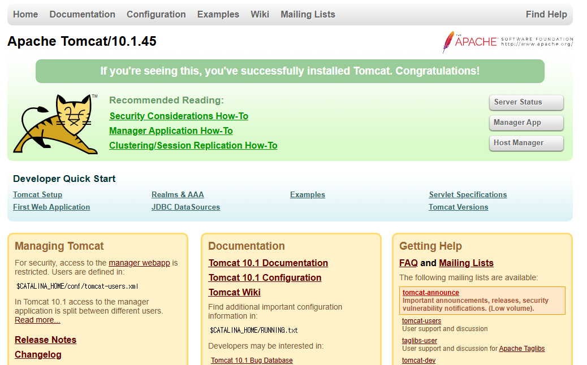
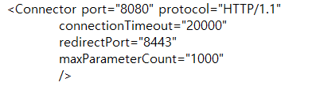

# Java file로 maven을 활용하여 pdf file 생성

# tomcat 
cd..으로 상위 디렉토리로 c:\  이렇게 만듦  
그 후 dir 해서 파일 이름 확인 cd tomcat10(내 파일 이름), cd bin 하면 C:\tomcat10\bin> 이렇게 됨  
./startup.bat 하면 실행 서버에 127.0.0.1:8080 치면 

화면 뜸  
종료 명령어  
./shutdown.bat

## 포트변경시  
빈 메모장에 열기 -> tomcat10에 conf 파일 들어가면 server 열기 (안 뜬다면 txt로 되어있기 때문 모든파일로 바꾸면 뜸)  
메모장에  
  
이 부분 포트를 8081로 변경하고 저장 다시 ./startup.bat 했을때 서버에 127.0.0.1:8081로 치면 뜸

